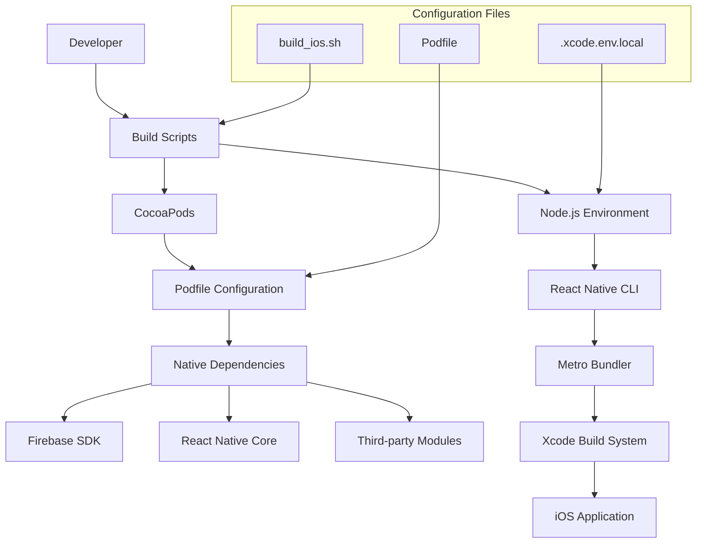
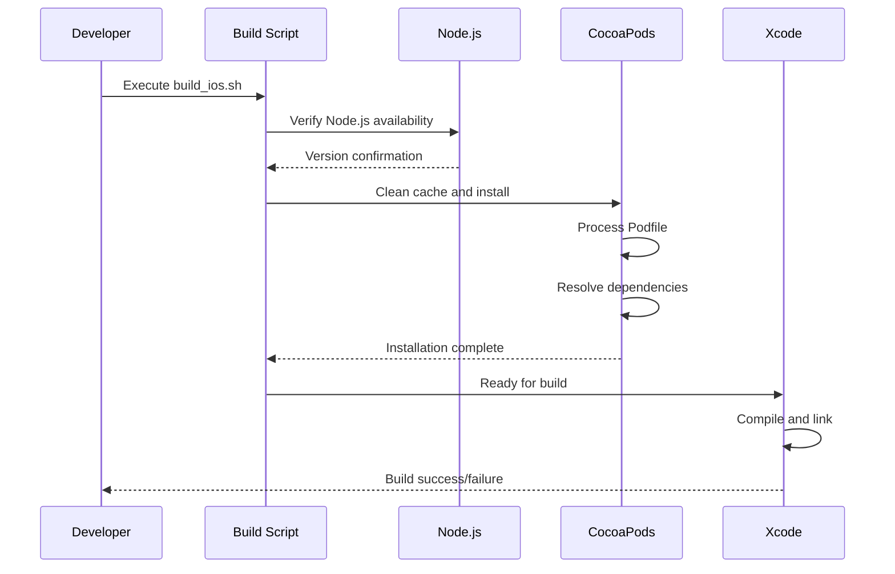

# Design Document: iOS Build Compatibility

## Overview

This design addresses critical iOS build compatibility issues in a React Native 0.75.4 project by implementing systematic fixes for CocoaPods configuration, header file resolution, build script compatibility, and Node.js path configuration. The solution focuses on updating deprecated configurations, ensuring proper dependency management, and establishing reliable build processes that work with the current toolchain (Xcode 16.2, React Native 0.75.4, Firebase SDK 10.28.0).

The approach prioritizes minimal disruption to existing functionality while ensuring forward compatibility and maintainability. All changes will be backward-compatible where possible and will follow React Native 0.75.4 best practices.

## Architecture

### Build System Components



### Dependency Resolution Flow



## Components and Interfaces

### 1. Podfile Configuration Manager

**Purpose**: Manages CocoaPods configuration with React Native 0.75.4 compatibility

**Key Responsibilities**:
- Remove deprecated FlipperConfiguration usage
- Configure proper iOS deployment targets
- Manage static framework linkage
- Handle Firebase SDK version constraints
- Apply post-install build setting modifications

**Interface**:
```ruby
# Core configuration functions
platform :ios, min_ios_version_supported
prepare_react_native_project!
use_frameworks! :linkage => :static

# Flipper configuration (conditional)
flipper_config = ENV['NO_FLIPPER'] == "1" ? FlipperConfiguration.disabled : FlipperConfiguration.enabled

# React Native integration
use_react_native!(
  :path => config[:reactNativePath],
  :flipper_configuration => flipper_config,
  :app_path => "#{Pod::Config.instance.installation_root}/.."
)
```

### 2. Build Environment Manager

**Purpose**: Ensures consistent build environment setup and validation

**Key Responsibilities**:
- Validate Node.js installation and version
- Configure Node.js path for Xcode builds
- Clean build artifacts and caches
- Verify dependency installation
- Provide build status feedback

**Interface**:
```bash
# Environment validation
verify_nodejs_installation()
configure_node_path()
clean_build_environment()
install_dependencies()
validate_build_readiness()
```

### 3. Header File Resolver

**Purpose**: Ensures all required React Native header files are accessible during compilation

**Key Responsibilities**:
- Configure header search paths for React Native 0.75.4
- Resolve missing RCTThirdPartyFabricComponentsProvider.h
- Handle RCTLegacyInteropComponents.h availability
- Manage framework header imports
- Support both Old and New Architecture headers

**Configuration**:
```ruby
# Post-install header path configuration
config.build_settings['HEADER_SEARCH_PATHS'] = [
  '$(inherited)',
  '"$(PODS_ROOT)/Headers/Public"',
  '"$(PODS_ROOT)/Headers/Private"',
  '"$(PODS_ROOT)/Headers/Private/React-Core"'
]
```

### 4. Dependency Compatibility Manager

**Purpose**: Manages compatibility between React Native 0.75.4 and third-party dependencies

**Key Responsibilities**:
- Ensure Firebase SDK 10.28.0 compatibility
- Handle Google Sign-In integration
- Manage Stripe SDK compatibility
- Configure static framework linkage
- Resolve version conflicts

**Configuration Matrix**:
```ruby
# Version compatibility matrix
$FirebaseSDKVersion = '10.28.0'
$ReactNativeVersion = '0.75.4'
$iOSDeploymentTarget = '15.1'
$XcodeVersion = '16.2'
```

## Correctness Properties

*A property is a characteristic or behavior that should hold true across all valid executions of a system—essentially, a formal statement about what the system should do. Properties serve as the bridge between human-readable specifications and machine-verifiable correctness guarantees.*

Based on the prework analysis, the following properties validate the critical aspects of iOS build compatibility:

### Property 1: CocoaPods Installation Success
*For any* React Native 0.75.4 project with a properly configured Podfile, running `pod install` should complete successfully without FlipperConfiguration errors or dependency conflicts.
**Validates: Requirements 1.1, 1.3**

### Property 2: Podfile Configuration Compliance
*For any* Podfile in a React Native 0.75.4 project, all configuration options should be compatible with the framework version, including proper deployment targets, framework linkage settings, and post-install hooks.
**Validates: Requirements 1.2, 1.4, 1.5**

### Property 3: Header File Resolution
*For any* React Native 0.75.4 compilation, all required header files (including RCTThirdPartyFabricComponentsProvider.h and RCTLegacyInteropComponents.h) should be accessible through properly configured header search paths.
**Validates: Requirements 2.1, 2.2, 2.3, 2.4, 2.5**

### Property 4: Build Script Compatibility
*For any* build script execution in the React Native 0.75.4 environment, the scripts should work correctly with Xcode 16.2, perform proper cleanup, install dependencies successfully, and provide clear feedback.
**Validates: Requirements 3.1, 3.2, 3.3, 3.5**

### Property 5: Node.js Environment Validation
*For any* build environment setup, Node.js should be properly detected, validated for version compatibility, configured for Xcode builds, and provide clear error messages when issues occur.
**Validates: Requirements 3.4, 4.1, 4.2, 4.3, 4.4, 4.5**

### Property 6: Xcode Build Success
*For any* properly configured React Native 0.75.4 project, Xcode builds (both simulator and command-line) should complete successfully with correct deployment targets and without configuration errors.
**Validates: Requirements 5.1, 5.2, 5.4, 5.5**

### Property 7: Dependency Compatibility
*For any* native dependency installation, Firebase SDK 10.28.0 and other third-party modules should resolve correctly, maintain compatibility with React Native 0.75.4, handle static framework linkage, and prevent version conflicts.
**Validates: Requirements 6.1, 6.2, 6.3, 6.4**

### Property 8: Complete Build Pipeline
*For any* end-to-end build process, the sequence of `pod install` followed by `xcodebuild` or `npx react-native run-ios` should execute successfully and produce valid build artifacts.
**Validates: Requirements 7.1, 7.2, 7.4, 7.5**

## Data Models

### Build Configuration Model

```typescript
interface BuildConfiguration {
  reactNativeVersion: string;
  iosDeploymentTarget: string;
  firebaseSDKVersion: string;
  flipperEnabled: boolean;
  useFrameworks: boolean;
  linkageType: 'static' | 'dynamic';
  nodeJSPath: string;
  xcodeVersion: string;
}
```

### Dependency Model

```typescript
interface NativeDependency {
  name: string;
  version: string;
  podspecPath?: string;
  configurations: string[];
  buildSettings: Record<string, any>;
  isCompatible: boolean;
}
```

### Build Environment Model

```typescript
interface BuildEnvironment {
  nodeJSVersion: string;
  nodeJSPath: string;
  cocoaPodsVersion: string;
  xcodeVersion: string;
  reactNativeCliVersion: string;
  isValid: boolean;
  validationErrors: string[];
}
```

## Error Handling

### CocoaPods Configuration Errors

**FlipperConfiguration Issues**:
- **Error**: `uninitialized constant Pod::Podfile::FlipperConfiguration`
- **Cause**: Incorrect FlipperConfiguration usage in React Native 0.75.4
- **Resolution**: Use conditional FlipperConfiguration with proper environment variable checks
- **Prevention**: Validate Podfile syntax against React Native 0.75.4 template

**Dependency Resolution Conflicts**:
- **Error**: Version conflicts between Firebase SDK and React Native
- **Cause**: Incompatible dependency versions
- **Resolution**: Pin Firebase SDK to 10.28.0 and ensure React Native 0.75.4 compatibility
- **Prevention**: Maintain dependency compatibility matrix

### Header File Resolution Errors

**Missing Header Files**:
- **Error**: `'RCTThirdPartyFabricComponentsProvider.h' file not found`
- **Cause**: Incorrect header search paths or missing React Native components
- **Resolution**: Configure proper header search paths and ensure React Native installation integrity
- **Prevention**: Validate React Native installation and header path configuration

**Framework Import Issues**:
- **Error**: Framework import failures for React Native modules
- **Cause**: Incorrect framework linkage or missing framework headers
- **Resolution**: Configure static framework linkage and update header search paths
- **Prevention**: Use React Native 0.75.4 recommended framework configuration

### Build Environment Errors

**Node.js Path Issues**:
- **Error**: Node.js not found during Xcode builds
- **Cause**: Incorrect NODE_BINARY configuration or missing Node.js installation
- **Resolution**: Configure .xcode.env.local with correct Node.js path
- **Prevention**: Validate Node.js installation and path configuration

**Build Script Failures**:
- **Error**: Build script execution failures
- **Cause**: Incompatible commands or missing dependencies
- **Resolution**: Update build scripts for React Native 0.75.4 and Xcode 16.2 compatibility
- **Prevention**: Test build scripts with target environment versions

### Xcode Build Errors

**Compilation Failures**:
- **Error**: Compilation errors due to missing symbols or headers
- **Cause**: Incorrect build settings or missing dependencies
- **Resolution**: Apply proper build settings and ensure dependency installation
- **Prevention**: Validate build configuration and dependency integrity

**Linking Errors**:
- **Error**: Undefined symbols during linking phase
- **Cause**: Missing libraries or incorrect linkage configuration
- **Resolution**: Configure proper library linkage and framework settings
- **Prevention**: Validate linkage configuration and library availability

## Testing Strategy

### Dual Testing Approach

The testing strategy employs both unit tests and property-based tests to ensure comprehensive coverage:

**Unit Tests**: Focus on specific examples, edge cases, and error conditions
- Validate specific Podfile configurations
- Test individual build script functions
- Verify error handling scenarios
- Check specific dependency resolution cases

**Property-Based Tests**: Verify universal properties across all inputs
- Test build success across different project configurations
- Validate configuration compliance with various settings
- Ensure header resolution works with different module combinations
- Verify environment validation across different Node.js installations

### Property-Based Testing Configuration

**Testing Framework**: Use **fast-check** for JavaScript/TypeScript property-based testing and **RSpec** with **rantly** for Ruby-based CocoaPods testing.

**Test Configuration**:
- Minimum 100 iterations per property test
- Each property test references its design document property
- Tag format: **Feature: ios-build-compatibility, Property {number}: {property_text}**

**Property Test Implementation**:

1. **Property 1 - CocoaPods Installation Success**:
   - Generate various Podfile configurations
   - Test `pod install` execution and validate success
   - **Feature: ios-build-compatibility, Property 1: CocoaPods Installation Success**

2. **Property 2 - Podfile Configuration Compliance**:
   - Generate different Podfile settings
   - Validate against React Native 0.75.4 compatibility rules
   - **Feature: ios-build-compatibility, Property 2: Podfile Configuration Compliance**

3. **Property 3 - Header File Resolution**:
   - Test compilation with various module combinations
   - Validate header accessibility across different configurations
   - **Feature: ios-build-compatibility, Property 3: Header File Resolution**

4. **Property 4 - Build Script Compatibility**:
   - Test build scripts with different environment configurations
   - Validate script execution and output across scenarios
   - **Feature: ios-build-compatibility, Property 4: Build Script Compatibility**

5. **Property 5 - Node.js Environment Validation**:
   - Test with different Node.js installation methods and versions
   - Validate environment detection and configuration
   - **Feature: ios-build-compatibility, Property 5: Node.js Environment Validation**

6. **Property 6 - Xcode Build Success**:
   - Test Xcode builds with various project configurations
   - Validate build success across different targets and settings
   - **Feature: ios-build-compatibility, Property 6: Xcode Build Success**

7. **Property 7 - Dependency Compatibility**:
   - Test dependency resolution with various module combinations
   - Validate compatibility across different dependency versions
   - **Feature: ios-build-compatibility, Property 7: Dependency Compatibility**

8. **Property 8 - Complete Build Pipeline**:
   - Test end-to-end build processes with different configurations
   - Validate complete pipeline success and artifact generation
   - **Feature: ios-build-compatibility, Property 8: Complete Build Pipeline**

### Integration Testing

**Build Pipeline Validation**:
- Test complete build process from clean state to successful compilation
- Validate integration between CocoaPods, Node.js, and Xcode
- Ensure compatibility across different development environments

**Environment Compatibility Testing**:
- Test across different macOS versions
- Validate with different Xcode versions (focusing on 16.2)
- Ensure compatibility with different Node.js installation methods

**Regression Testing**:
- Maintain test suite for React Native version compatibility
- Validate against Firebase SDK updates
- Ensure backward compatibility with existing project configurations
```

Now I need to use the prework tool to analyze the acceptance criteria before writing the Correctness Properties section:

<function_calls>
<invoke name="prework">
<parameter name="featureName">ios-build-compatibility